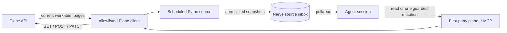
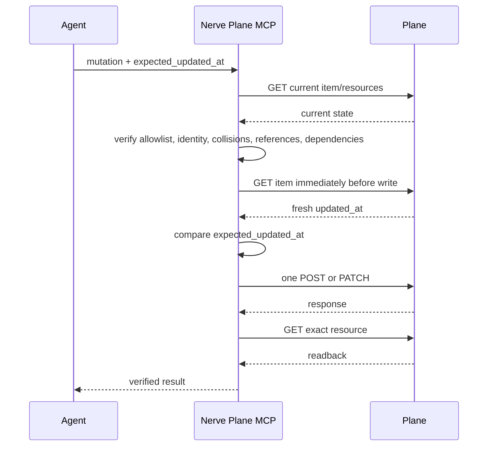

# Plane Integration

Nerve integrates Plane in two independent ways:

1. A scheduled source notices changed work items and places normalized
   snapshots in the source inbox.
2. A small first-party MCP surface lets an agent inspect and, when authorized,
   change individual work items.

Both paths use the same credential, workspace slug, and explicit project UUID
allowlist. The integration is disabled by default.

## Data flow



Plane data entering through the source is external, untrusted input. A source
record can inform an agent that a task changed; it cannot grant permission to
perform a mutation.

## Configuration

Configure Plane in `config.local.yaml` so instance-specific settings remain
outside the committed configuration:

```yaml
sync:
  plane:
    enabled: true
    base_url: "https://plane.example.com"
    workspace_slug: "example-workspace"
    projects:
      - "11111111-1111-4111-8111-111111111111"
    api_key_env: ""
    api_key_file: "/absolute/path/to/plane-agent.env"
    api_key_file_env: "PLANE_API_TOKEN"
    schedule: "*/5 * * * *"
    batch_size: 50
    initial_backfill: false
    max_pages_per_project: 20
```

The credential file format is a simple env assignment:

```text
PLANE_API_TOKEN=replace-with-the-dedicated-agent-token
```

The file must be an absolute, regular, non-symlink path owned by the Nerve
service user with mode `0600` or stricter. Nerve reads only the configured
variable. It does not execute or source the file.

Credential resolution order is:

1. `api_key`;
2. a non-empty `api_key_env`;
3. `api_key_file` plus `api_key_file_env`.

Use a dedicated Plane Member identity. Do not use an Admin credential for
ordinary task work.

## Source behavior

The source requests current work items with expanded state, assignees, and
labels. It emits a `plane_work_item` snapshot containing the normalized title,
description, priority, state, assignees, labels, timestamps, and project
identity.

Each configured project has an independent cursor watermark:

```text
project UUID -> latest updated_at + IDs sharing that timestamp
```

This gives the source four important properties:

- The first run establishes a baseline by default, so enabling the source does
  not flood the inbox with the existing backlog.
- A changed work item re-surfaces because its stable Plane UUID keeps the same
  source record identity while its normalized content changes.
- A failed project does not advance its cursor; healthy projects can continue.
- A global batch limit advances only projects represented in the emitted
  batch, so queued changes are not skipped.

Set `initial_backfill: true` only when the existing backlog should be emitted.
`max_pages_per_project` bounds one snapshot and fails closed if pagination does
not terminate or its cursor stops advancing.

The current source tracks work-item snapshots. It does not independently emit
comment/activity events, relation changes, or deletion tombstones.

## MCP surface

| Tool | Purpose | Write guard |
|---|---|---|
| `plane_list_projects` | Show configured projects | Read-only |
| `plane_list_states` | Resolve workflow state IDs/groups | Read-only |
| `plane_list_members` | Resolve redacted member IDs/roles | Read-only |
| `plane_list_labels` | Resolve label IDs | Read-only |
| `plane_list_work_items` | Browse paginated work items | Read-only |
| `plane_get_work_item` | Read one item and its `updated_at` | Read-only |
| `plane_create_work_item` | Create one item | Exact-title collision check and readback |
| `plane_update_work_item` | Change selected core fields | Required `expected_updated_at`, reference/dependency checks, readback |
| `plane_add_comment` | Add one plain-text internal comment | Required `expected_updated_at`, duplicate check, readback |
| `plane_add_link` | Add one credential-free HTTP(S) link | Required `expected_updated_at`, URL collision check, readback |

There are intentionally no delete, archive, bulk, role, membership,
credential, workspace, project-admin, or automatic-retry tools.

## Mutation protocol

An update, comment, or link follows this sequence:



If the fresh timestamp differs, the tool reports a conflict and performs no
write. A state change into `started` or `completed` also refuses to proceed
while a `blocked_by` predecessor is incomplete. State, assignee, and label IDs
must exist in the target project. Assignee and label arrays are treated as the
complete intended sets.

The client never automatically retries a failed POST or PATCH. If a response
is ambiguous, inspect Plane before deciding whether another write is safe.

### Example: update one item

First read the item:

```json
{
  "project_id": "11111111-1111-4111-8111-111111111111",
  "work_item_id": "22222222-2222-4222-8222-222222222222"
}
```

Then pass the exact returned timestamp:

```json
{
  "project_id": "11111111-1111-4111-8111-111111111111",
  "work_item_id": "22222222-2222-4222-8222-222222222222",
  "expected_updated_at": "2026-07-27T12:34:56.000000Z",
  "state": "33333333-3333-4333-8333-333333333333",
  "assignees": ["44444444-4444-4444-8444-444444444444"]
}
```

Do not reuse an old timestamp for a later mutation. Read the item again.

## Rollout checklist

1. Configure the exact instance, workspace, and project UUID allowlist.
2. Verify the dedicated Member credential file owner and mode without printing
   its value.
3. Load the configuration and confirm the source registers.
4. Restart only Nerve when a restart is required.
5. Verify the new process and health endpoint.
6. Run read-only MCP inventory: projects, states, members, labels, work items.
7. Confirm the first source fetch produces a cursor and, with the default
   baseline, no historical records.
8. Exercise mutations only with explicit authority and synthetic or intended
   targets; verify Plane readback.

Keep the integration disabled if any identity, allowlist, credential, cursor,
or readback check is ambiguous.
